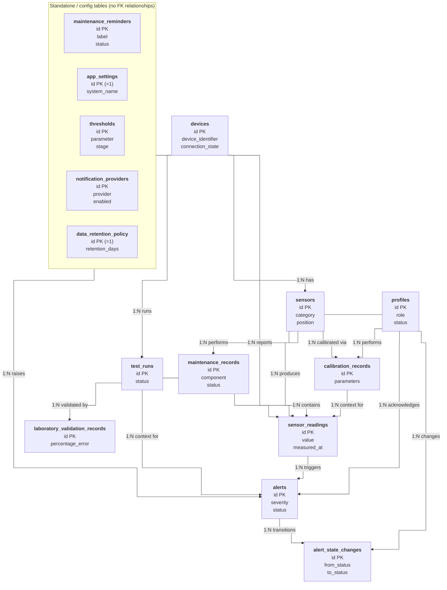

# Database ERD (flowchart / elbow-connector version)

Mermaid's `erDiagram` type has no orthogonal/elbow line-routing option — its
config schema exposes only padding, spacing, colors, font size, and layout
direction, nothing for connector shape. `flowchart` diagrams do support it
(`curve: 'step'`), so this is the same relationships as
[DATABASE_SCHEMA.md](DATABASE_SCHEMA.md)'s `erDiagram`, redrawn as a
`flowchart` for right-angle connectors in Typora's preview.

**Trade-off, read before treating this as authoritative:** flowchart has no
native crow's-foot cardinality notation or entity/attribute boxes, so:

- Cardinality is written as a plain `1:N` label on each edge instead of
  Mermaid's `||--o{` notation.
- Each node lists only its primary key plus 1–2 identifying columns, not
  every column — full column-by-column detail (types, nullability, `TBD`
  notes) lives in [DATABASE_SCHEMA.md](DATABASE_SCHEMA.md) §§1–15. Treat
  that document as the source of truth for anything beyond "what connects
  to what."

If this diagram and `DATABASE_SCHEMA.md`'s `erDiagram` ever disagree on
relationships, `DATABASE_SCHEMA.md` wins — this file exists purely for a
cleaner visual in Typora, not as a second schema definition.

