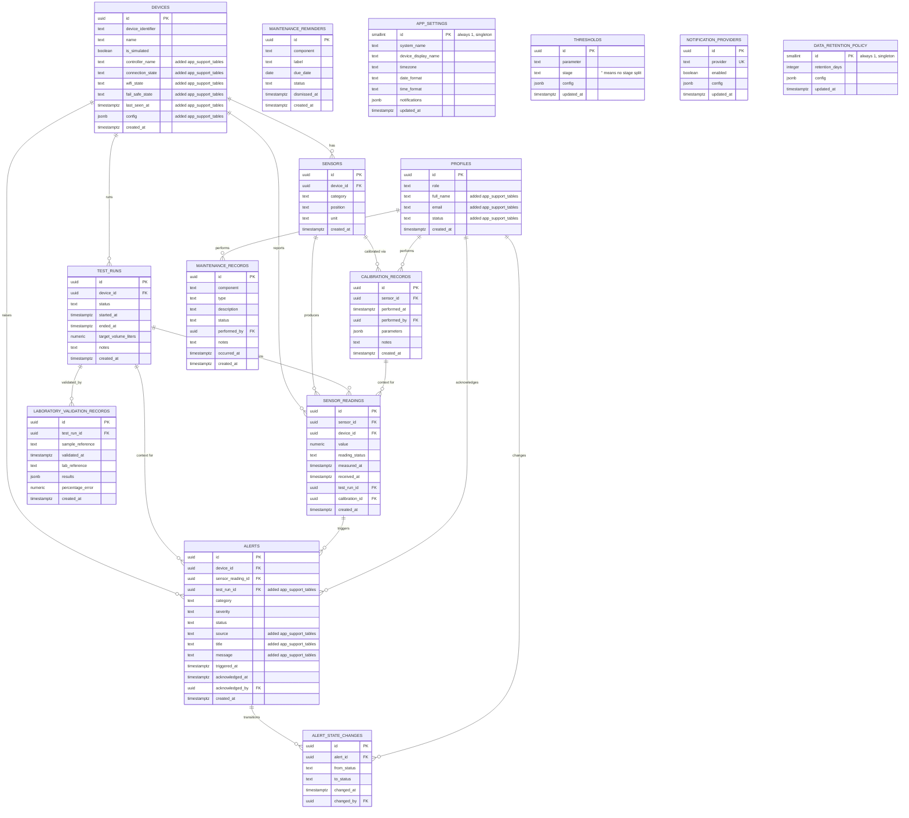

# Database Schema

> **Merged from the former `DATABASE_SCHEMA_DRAFT.md` (original proposal +
> ERD) and `SCHEMA_TBD_LOG.md` (what changed going into the actual
> migrations) — those two were split across files but always meant to be
> read together.** The tables below were implemented essentially as
> originally drafted, in `supabase/migrations/20260916110448_initial_schema.sql`,
> then extended by two follow-up migrations. For the actual current schema,
> the migrations under `supabase/migrations/` are the source of truth — this
> document is the design rationale and a plain-English index into it, not a
> live spec. Every column still marked `TBD` remains a genuinely open
> business decision; implementing the table stopped blocking on it without
> resolving it (see [PENDING_DECISIONS.md](PENDING_DECISIONS.md)).

## Purpose

[DATABASE.md](DATABASE.md) defines the planned data domains but explicitly
defers schema design until the API and hardware data contracts are resolved.
This document gives the team something concrete for the domains that are
already confirmed, while leaving every undecided detail marked `TBD` rather
than guessed. See [PENDING_DECISIONS.md](PENDING_DECISIONS.md) §§3, 4, 5, 8,
9, 10, 11 for the specific open items the original design did not resolve.

Column types are illustrative (Postgres/Supabase).

## Entity-relationship diagram

All 15 tables as they exist after both follow-up migrations (originally 9;
see "Follow-up migrations" below for what `app_support_tables` and
`enable_rls` each added). Columns added after the original 9-table design
are marked `// added <migration>`.

Prefer right-angle connector lines (e.g. viewing this in Typora)? See
[DATABASE_ERD_FLOWCHART.md](DATABASE_ERD_FLOWCHART.md) — a `flowchart`
redraw of the same relationships. It trades away crow's-foot notation and
full column lists for elbow routing, so this `erDiagram` below stays the
authoritative one.

`MAINTENANCE_REMINDERS`, `APP_SETTINGS`, `THRESHOLDS`,
`NOTIFICATION_PROVIDERS`, and `DATA_RETENTION_POLICY` have no foreign keys
(no relationship lines above) — each is either a standalone lookup/config
table or a singleton row.

---

## 1. `devices`

Satisfies: DATABASE.md domain "devices and device status."

| Column | Type | Notes |
| --- | --- | --- |
| id | uuid, pk | |
| device_identifier | text, unique | matches ESP32/simulator identity — mechanism `TBD` (PENDING_DECISIONS §8) |
| name | text | |
| is_simulated | boolean | required per ARCHITECTURE.md: "simulator records must remain explicitly identified as simulated data" |
| controller_name | text | added by `app_support_tables` |
| connection_state | text, default `'Pending Hardware Integration'` | added by `app_support_tables`; set by `PUT /devices/:id/config` or a successful `POST /devices/:id/readings` (bumped to `'Online'`), and by `deviceWatchdog.ts` (bumped to `'Offline'`) |
| wifi_state | text, default `'Not Configured'` | added by `app_support_tables` |
| fail_safe_state | text, default `'Pending Hardware Integration'` | added by `app_support_tables` |
| last_seen_at | timestamptz, nullable | added by `app_support_tables`; the heartbeat timestamp `deviceWatchdog.ts` compares against `DEVICE_OFFLINE_TIMEOUT_MS` |
| config | jsonb, default `{}` | added by `app_support_tables` |
| created_at | timestamptz | |

Device "status" was not a stored column in the original 9-table design — the
`connection_state`/`last_seen_at` columns above (from the `app_support_tables`
follow-up migration) are what actually track it now, per a hardcoded
timeout default rather than an approved rule (PENDING_DECISIONS §6).

---

## 2. `sensors`

Satisfies: DATABASE.md domain "sensor definitions and sensor positions."

| Column | Type | Notes |
| --- | --- | --- |
| id | uuid, pk | |
| device_id | uuid, fk -> devices.id | |
| category | text | confirmed set: ph, turbidity, tds, temperature, flow_rate (REQUIREMENTS.md) — still free `text`, no CHECK/enum added |
| position | text | confirmed set: pre_filtration, post_filtration (REQUIREMENTS.md) — same |
| unit | text | |
| created_at | timestamptz | |

---

## 3. `sensor_readings`

Satisfies: DATABASE.md domain "time-series readings for pH, turbidity, TDS,
temperature, and flow rate."

| Column | Type | Notes |
| --- | --- | --- |
| id | uuid, pk | |
| sensor_id | uuid, fk -> sensors.id | |
| device_id | uuid, fk -> devices.id | denormalized for query convenience |
| value | numeric, nullable | null represents "unavailable," per API_CONTRACT.md's requirement to distinguish unavailable data from a measured value |
| reading_status | text | e.g. valid/invalid/unavailable/stale — free `text`, exact rule per sensor still `TBD` (HARDWARE_INTEGRATION.md, PENDING_DECISIONS §3) |
| measured_at | timestamptz | device-reported time |
| received_at | timestamptz | server receipt time |
| test_run_id | uuid, fk -> test_runs.id, nullable | |
| calibration_id | uuid, fk -> calibration_records.id, nullable | calibration context in effect, per DATABASE.md integrity principle |
| created_at | timestamptz | |

---

## 4. `test_runs`

Satisfies: DATABASE.md domain "test runs."

| Column | Type | Notes |
| --- | --- | --- |
| id | uuid, pk | |
| device_id | uuid, fk -> devices.id | |
| status | text | free `text`; lifecycle values still `TBD` (PENDING_DECISIONS §5 — cycle-completion logic, 1 L target vs. timeout) |
| started_at | timestamptz | |
| ended_at | timestamptz, nullable | |
| target_volume_liters | numeric, nullable | "1 L" concept mentioned by client but cycle-completion logic is `TBD` |
| notes | text | |
| created_at | timestamptz | |

---

## 5. `alerts`

Satisfies: DATABASE.md domain "alerts and alert state changes" (part 1).

| Column | Type | Notes |
| --- | --- | --- |
| id | uuid, pk | |
| device_id | uuid, fk -> devices.id | |
| sensor_reading_id | uuid, fk -> sensor_readings.id, nullable | triggering reading, if any |
| test_run_id | uuid, fk -> test_runs.id, nullable | added by `app_support_tables` |
| category | text | free `text`; taxonomy still `TBD` (PENDING_DECISIONS §4) |
| severity | text | free `text`; scale still `TBD` (PENDING_DECISIONS §4) |
| status | text | free `text`; exact lifecycle still `TBD` (PENDING_DECISIONS §4) |
| source | text, nullable | added by `app_support_tables`; human-readable origin, e.g. `"Pre-Filtration Turbidity Sensor"` — what `alertEngine.ts`/`deviceWatchdog.ts` dedupe on (with `device_id`) |
| title | text, nullable | added by `app_support_tables` |
| message | text, nullable | added by `app_support_tables` |
| triggered_at | timestamptz | |
| acknowledged_at | timestamptz, nullable | |
| acknowledged_by | uuid, fk -> profiles.id, nullable | "who may operate remote controls / acknowledge" is `TBD` (PENDING_DECISIONS §9) |
| created_at | timestamptz | |

Alert *content* (thresholds, what triggers an alert) is entirely `TBD` per
PENDING_DECISIONS §4 and is not implied by this table — the alert-evaluation
code exists (`src/lib/alertEngine.ts`) but is inert until thresholds are
configured.

---

## 6. `alert_state_changes`

Satisfies: DATABASE.md domain "alerts and alert state changes" (part 2).

| Column | Type | Notes |
| --- | --- | --- |
| id | uuid, pk | |
| alert_id | uuid, fk -> alerts.id | |
| from_status | text | |
| to_status | text | |
| changed_at | timestamptz | |
| changed_by | uuid, fk -> profiles.id, nullable | |

---

## 7. `calibration_records`

Satisfies: DATABASE.md domain "calibration records." Kept as a separate
table from `laboratory_validation_records` per DATABASE.md's integrity
principle: "Keep calibration records separate from laboratory validation
records."

| Column | Type | Notes |
| --- | --- | --- |
| id | uuid, pk | |
| sensor_id | uuid, fk -> sensors.id | |
| performed_at | timestamptz | |
| performed_by | uuid, fk -> profiles.id, nullable | "who may edit thresholds/configuration" is `TBD` (PENDING_DECISIONS §9) |
| parameters | jsonb, no fixed shape | calibration formulas/factors are `TBD` (PENDING_DECISIONS §12); jsonb avoids inventing specific columns |
| notes | text | |
| created_at | timestamptz | |

---

## 8. `laboratory_validation_records`

Satisfies: DATABASE.md domain "laboratory validation records."

| Column | Type | Notes |
| --- | --- | --- |
| id | uuid, pk | |
| test_run_id | uuid, fk -> test_runs.id, nullable | |
| sample_reference | text | |
| validated_at | timestamptz | |
| lab_reference | text | |
| results | jsonb, no fixed shape | required fields are `TBD` (PENDING_DECISIONS §12) |
| percentage_error | numeric, nullable | formula is a placeholder, not confirmed (PENDING_DECISIONS §12) — see `docs/API_REFERENCE.md` → Laboratory Validation |
| created_at | timestamptz | |

Per HARDWARE_INTEGRATION.md and REQUIREMENTS.md: a record in this table must
never be presented, by itself or via the dashboard, as proof that water is
safe to drink.

---

## 9. `profiles`

Minimal stub in the original design — no permissions logic implied. Exists
so the `*_by` columns above have somewhere to point. `id` mirrors Supabase
`auth.users.id`.

| Column | Type | Notes |
| --- | --- | --- |
| id | uuid, pk (= auth.users.id) | |
| role | text | free `text`, defaults to `'Viewer'` on creation; final roles/permissions entirely `TBD` (PENDING_DECISIONS §9) |
| full_name | text, nullable | added by `app_support_tables` |
| email | text, nullable | added by `app_support_tables` |
| status | text, default `'Active'` | added by `app_support_tables`; app-level flag only, does not suspend the underlying Supabase Auth account |
| created_at | timestamptz | |

A Postgres trigger (`on_auth_user_created`, added by `app_support_tables`)
auto-inserts a row here whenever a Supabase Auth user is created — role
defaults to `'Viewer'`, status to `'Active'` — so every route that expects a
profile to already exist (e.g. right after `POST /auth/login`) always finds
one.

---

## 10. `maintenance_records`

Added by `app_support_tables` — not one of the original 9 domains
(Maintenance wasn't a `DATABASE.md`-listed domain).

| Column | Type | Notes |
| --- | --- | --- |
| id | uuid, pk | |
| component | text | |
| type | text, nullable | |
| description | text, nullable | |
| status | text, nullable | |
| performed_by | uuid, fk -> profiles.id, nullable | resolved from the caller's `full_name` at write time, falls back to email then `"Unknown"` |
| notes | text, nullable | |
| occurred_at | timestamptz | |
| created_at | timestamptz | |

---

## 11. `maintenance_reminders`

Added by `app_support_tables`.

| Column | Type | Notes |
| --- | --- | --- |
| id | uuid, pk | |
| component | text | |
| label | text | |
| due_date | date, nullable | |
| status | text, default `'Upcoming'` | `PATCH /maintenance/reminders/:id/dismiss` sets this to `'Dismissed'` — a value `frontend/src/types/index.ts`'s `MaintenanceReminder.status` union doesn't have yet |
| dismissed_at | timestamptz, nullable | |
| created_at | timestamptz | |

---

## 12. `app_settings`

Added by `app_support_tables`. Singleton — `id` is constrained to always be
`1`, so `GET/PUT /settings` always reads/writes the same row.

| Column | Type | Notes |
| --- | --- | --- |
| id | smallint, pk, `check (id = 1)` | |
| system_name | text, nullable | |
| device_display_name | text, nullable | |
| timezone | text, nullable | |
| date_format | text, nullable | |
| time_format | text, nullable | |
| notifications | jsonb, default `{}` | per-category on/off toggles read by `notificationService.ts` |
| updated_at | timestamptz | |

---

## 13. `thresholds`

Added by `app_support_tables`. Content shape is deliberately opaque —
"approved thresholds" is `TBD` (PENDING_DECISIONS §4/§12).

| Column | Type | Notes |
| --- | --- | --- |
| id | uuid, pk | |
| parameter | text | |
| stage | text, default `''` | empty string (not `null`) so `unique (parameter, stage)` can back an upsert `on_conflict` target — Postgres treats `NULL` as distinct in unique constraints, which would break de-duplication for a parameter-level (no-stage) threshold |
| config | jsonb, default `{}` | e.g. `{ "min": 6.5, "max": 8.5 }` — shape is `TBD` |
| updated_at | timestamptz | |

---

## 14. `notification_providers`

Added by `app_support_tables`. SMS/notification provider choice is `TBD`
(PENDING_DECISIONS "SMS provider") — this table exists so the dispatch
plumbing (`notificationService.ts`) has somewhere to read enabled providers
from, without picking one.

| Column | Type | Notes |
| --- | --- | --- |
| id | uuid, pk | |
| provider | text, unique | e.g. `"twilio"` — only `"log"` (built-in, not stored here) is actually implemented |
| enabled | boolean, default `false` | enabling a provider with no matching registry entry logs a warning instead of sending anything |
| config | jsonb, default `{}` | |
| updated_at | timestamptz | |

---

## 15. `data_retention_policy`

Added by `app_support_tables`. Singleton — `id` is constrained to always be
`1`.

| Column | Type | Notes |
| --- | --- | --- |
| id | smallint, pk, `check (id = 1)` | |
| retention_days | integer, nullable | `null` (the default) makes `retentionJob.ts` a no-op; the actual number is a policy decision, not hardcoded |
| config | jsonb, default `{}` | |
| updated_at | timestamptz | |

---

## How the original design was carried into the migration

`supabase/migrations/20260916110448_initial_schema.sql` implements all 9
tables above with the same columns, types, and foreign keys. No CHECK
constraints, RLS policies, or enum types were added — every "confirmed set"
or `TBD` column was implemented as plain `text` or `jsonb` so nothing had to
be guessed beyond what's written above.

### Columns still unconstrained (open items live here now, not in the design)

| Table.column | Currently | Resolve via |
| --- | --- | --- |
| `sensors.category` | free `text` | REQUIREMENTS.md already confirms the set — add a CHECK or enum once the team wants it enforced |
| `sensors.position` | free `text` | REQUIREMENTS.md already confirms the set — same as above |
| `sensor_readings.reading_status` | free `text` | PENDING_DECISIONS §3 — per-sensor validity rule not decided |
| `test_runs.status` | free `text` | PENDING_DECISIONS §5 — cycle-completion logic not decided |
| `alerts.category` | free `text` | PENDING_DECISIONS §4 — alert taxonomy not decided |
| `alerts.severity` | free `text` | PENDING_DECISIONS §4 — severity scale not decided |
| `alerts.status` | free `text` | PENDING_DECISIONS §4 — lifecycle not decided |
| `profiles.role` | free `text` | PENDING_DECISIONS §9 — roles/permissions not decided |
| `calibration_records.parameters` | `jsonb`, no shape | PENDING_DECISIONS §12 — calibration formula/factors not decided |
| `laboratory_validation_records.results` | `jsonb`, no shape | PENDING_DECISIONS §12 — required lab fields not decided |
| `laboratory_validation_records.percentage_error` | `numeric`, formula unconfirmed | PENDING_DECISIONS §12 |

## Follow-up migrations

### `20260916120000_app_support_tables.sql`

Implementing [API_REFERENCE.md](API_REFERENCE.md) needed a few domains the
initial schema didn't cover (Maintenance, Settings, richer Device/User
metadata), plus some free-text columns the Alerts table needed. Every column
and table it added is folded into the numbered sections above (§§1, 5, 9–15)
rather than listed again here. Every business-rule field on these additions
(threshold config, alert taxonomy, roles) is still free-form `text`/`jsonb`,
same philosophy as the original migration — nothing here resolves an item in
`PENDING_DECISIONS.md`. See `docs/API_REFERENCE.md` for how the Express API
maps these tables onto the frontend's expected JSON shapes, and for which
mapping choices (e.g. telemetry grouping, percentage-error formula) are
engineering placeholders rather than approved business rules.

### `20260919090000_enable_rls.sql`

Enables Row-Level Security on all 15 `public` tables with **zero policies**,
so `anon`/`authenticated` are deny-by-default (confirmed: a direct PostgREST
read with the anon key now returns `[]` instead of every row).
`service_role` (what this backend's `supabaseAdmin` client always uses) is
unaffected — it has `BYPASSRLS`. This is a security floor, not a permissions
design: no per-role policies exist yet, since who-can-read-what is still
open (PENDING_DECISIONS.md "user authorization"). See `docs/SECURITY.md` for
the full access-control picture.

## What's still genuinely not implemented

- **Data retention / backup strategy** — partially done: `src/lib/retentionJob.ts`
  purges old `sensor_readings` on a policy read from `data_retention_policy`,
  but is a no-op until a retention period is actually set; backup strategy
  itself remains untouched (PENDING_DECISIONS §11).
- **Device authentication mechanism** — `devices.device_identifier` has no
  enforced link to how an ESP32/simulator proves its identity; a placeholder
  shared secret (`X-Device-Key`) stands in for now (PENDING_DECISIONS §8).
- **Offline buffering / idempotency handling** for `sensor_readings` inserts
  (PENDING_DECISIONS §7).
- **Remote command delivery, expiration, or audit table** — no table exists
  for this yet (PENDING_DECISIONS §10).
- **Device online/offline status as a timeout-derived value** — `devices.connection_state`
  exists and is set by `src/lib/deviceWatchdog.ts` polling for a stale
  `last_seen_at`, but the actual offline-timeout threshold is a hardcoded
  engineering default (`DEVICE_OFFLINE_TIMEOUT_MS`), not an approved rule
  (PENDING_DECISIONS §6).
- **Per-role RLS policies** — see "Follow-up migrations" above.
- **Any concrete threshold, enum value, or business rule** for alerts,
  sensor-failure detection, or the filtration cycle (PENDING_DECISIONS §§3,
  4, 5).

## Next steps

1. Resolve items in `PENDING_DECISIONS.md` as the team firms them up.
2. Add follow-up migrations for CHECK constraints, RLS policies, and any new
   tables (e.g. remote commands) rather than editing existing migrations in
   place, once those decisions land.
3. Regenerate `src/types/database.types.ts` (`npm run gen:types`) after every
   new migration — it's checked in, not generated at build time.
