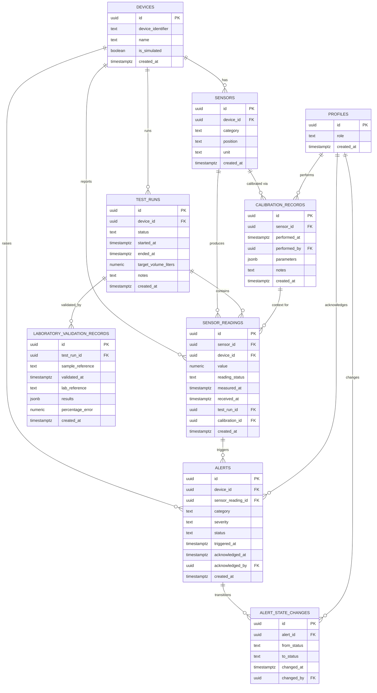

# Database Schema Draft

> **Status: unapproved draft, not implementation.** This document proposes
> table structure for team review only. It does not resolve any item in
> [PENDING_DECISIONS.md](PENDING_DECISIONS.md). No migration exists yet. Do
> not treat any name, enum, or default below as final until the team
> approves it and updates `PENDING_DECISIONS.md` accordingly.

## Purpose

[DATABASE.md](DATABASE.md) defines the planned data domains but explicitly
defers schema design until the API and hardware data contracts are resolved.
This draft gives the team something concrete to react to for the domains that
are already confirmed, while leaving every undecided detail marked `TBD`
rather than guessed. See [PENDING_DECISIONS.md](PENDING_DECISIONS.md) §§3, 4,
5, 8, 9, 10, 11 for the specific open items this draft does not resolve.

Column types are illustrative (Postgres/Supabase). No table includes RLS
policy, retention, or migration-tool decisions — those remain `TBD` per
PENDING_DECISIONS.md §11.

## Entity-relationship diagram

---

## 1. `devices`

Satisfies: DATABASE.md domain "devices and device status."

| Column | Type | Notes |
| --- | --- | --- |
| id | uuid, pk | |
| device_identifier | text, unique | matches ESP32/simulator identity — mechanism `TBD` (PENDING_DECISIONS §8) |
| name | text | |
| is_simulated | boolean | required per ARCHITECTURE.md: "simulator records must remain explicitly identified as simulated data" |
| created_at | timestamptz | |

Device "status" (online/offline) is not a stored column — offline-device
timeout logic is `TBD` (PENDING_DECISIONS §6), so this should likely be
derived from latest `sensor_readings.received_at` rather than persisted,
until that decision is made.

---

## 2. `sensors`

Satisfies: DATABASE.md domain "sensor definitions and sensor positions."

| Column | Type | Notes |
| --- | --- | --- |
| id | uuid, pk | |
| device_id | uuid, fk -> devices.id | |
| category | text | confirmed set: ph, turbidity, tds, temperature, flow_rate (REQUIREMENTS.md) |
| position | text | confirmed set: pre_filtration, post_filtration (REQUIREMENTS.md) |
| unit | text | |
| created_at | timestamptz | |

---

## 3. `sensor_readings`

Satisfies: DATABASE.md domain "time-series readings for pH, turbidity, TDS,
temperature, and flow rate."

| Column | Type | Notes |
| --- | --- | --- |
| id | uuid, pk | |
| sensor_id | uuid, fk -> sensors.id | |
| device_id | uuid, fk -> devices.id | denormalized for query convenience |
| value | numeric, nullable | null represents "unavailable," per API_CONTRACT.md's requirement to distinguish unavailable data from a measured value |
| reading_status | text | e.g. valid/invalid/unavailable/stale — exact rule per sensor is `TBD` (HARDWARE_INTEGRATION.md, PENDING_DECISIONS §3) |
| measured_at | timestamptz | device-reported time |
| received_at | timestamptz | server receipt time |
| test_run_id | uuid, fk -> test_runs.id, nullable | |
| calibration_id | uuid, fk -> calibration_records.id, nullable | calibration context in effect, per DATABASE.md integrity principle |
| created_at | timestamptz | |

---

## 4. `test_runs`

Satisfies: DATABASE.md domain "test runs."

| Column | Type | Notes |
| --- | --- | --- |
| id | uuid, pk | |
| device_id | uuid, fk -> devices.id | |
| status | text | lifecycle values `TBD` |
| started_at | timestamptz | |
| ended_at | timestamptz, nullable | |
| target_volume_liters | numeric, nullable | "1 L" concept mentioned by client but cycle-completion logic is `TBD` (PENDING_DECISIONS §5) |
| notes | text | |
| created_at | timestamptz | |

---

## 5. `alerts`

Satisfies: DATABASE.md domain "alerts and alert state changes" (part 1).

| Column | Type | Notes |
| --- | --- | --- |
| id | uuid, pk | |
| device_id | uuid, fk -> devices.id | |
| sensor_reading_id | uuid, fk -> sensor_readings.id, nullable | triggering reading, if any |
| category | text | taxonomy `TBD` |
| severity | text | scale `TBD` |
| status | text | e.g. open/acknowledged/resolved — exact lifecycle `TBD` |
| triggered_at | timestamptz | |
| acknowledged_at | timestamptz, nullable | |
| acknowledged_by | uuid, fk -> profiles.id, nullable | "who may operate remote controls / acknowledge" is `TBD` (PENDING_DECISIONS §9) |
| created_at | timestamptz | |

Alert *content* (thresholds, what triggers an alert) is entirely `TBD` per
PENDING_DECISIONS §4 and is not implied by this table.

---

## 6. `alert_state_changes`

Satisfies: DATABASE.md domain "alerts and alert state changes" (part 2).

| Column | Type | Notes |
| --- | --- | --- |
| id | uuid, pk | |
| alert_id | uuid, fk -> alerts.id | |
| from_status | text | |
| to_status | text | |
| changed_at | timestamptz | |
| changed_by | uuid, fk -> profiles.id, nullable | |

---

## 7. `calibration_records`

Satisfies: DATABASE.md domain "calibration records." Kept as a separate
table from `laboratory_validation_records` per DATABASE.md's integrity
principle: "Keep calibration records separate from laboratory validation
records."

| Column | Type | Notes |
| --- | --- | --- |
| id | uuid, pk | |
| sensor_id | uuid, fk -> sensors.id | |
| performed_at | timestamptz | |
| performed_by | uuid, fk -> profiles.id, nullable | "who may edit thresholds/configuration" is `TBD` (PENDING_DECISIONS §9) |
| parameters | jsonb | calibration formulas/factors are `TBD` (PENDING_DECISIONS §12); jsonb avoids inventing specific columns |
| notes | text | |
| created_at | timestamptz | |

---

## 8. `laboratory_validation_records`

Satisfies: DATABASE.md domain "laboratory validation records."

| Column | Type | Notes |
| --- | --- | --- |
| id | uuid, pk | |
| test_run_id | uuid, fk -> test_runs.id, nullable | |
| sample_reference | text | |
| validated_at | timestamptz | |
| lab_reference | text | |
| results | jsonb | required fields are `TBD` (PENDING_DECISIONS §12) |
| percentage_error | numeric, nullable | formula confirmation `TBD` (PENDING_DECISIONS §12) |
| created_at | timestamptz | |

Per HARDWARE_INTEGRATION.md and REQUIREMENTS.md: a record in this table must
never be presented, by itself or via the dashboard, as proof that water is
safe to drink.

---

## 9. `profiles`

Minimal stub only — no permissions logic implied. Exists so the `*_by`
columns above have somewhere to point. `id` mirrors Supabase
`auth.users.id`.

| Column | Type | Notes |
| --- | --- | --- |
| id | uuid, pk (= auth.users.id) | |
| role | text | final roles/permissions entirely `TBD` (PENDING_DECISIONS §9) |
| created_at | timestamptz | |

---

## Explicitly out of scope for this draft

Per PENDING_DECISIONS.md, the following are not addressed and must not be
inferred from the tables above:

- Row-Level Security policies (§11)
- Data retention / backup strategy (§11)
- Migration tooling/workflow (§11)
- Device authentication mechanism (§8)
- Offline buffering / idempotency handling (§7)
- Remote command delivery, expiration, or audit table (§10)
- Any concrete threshold, enum value, or business rule for alerts,
  sensor-failure detection, or the filtration cycle (§§3, 4, 5)

## Next steps

1. Team review (Alejandro, Nash, Edgar) of table shapes and relationships.
2. Resolve blocking items above only as far as needed to firm up columns
   marked `TBD`.
3. Convert this draft into real Supabase migrations under `database/`, per
   whatever migration tool the team confirms (PENDING_DECISIONS §11).
4. Update `PENDING_DECISIONS.md` to reflect any items resolved in the
   process, per that document's own decision rule.
