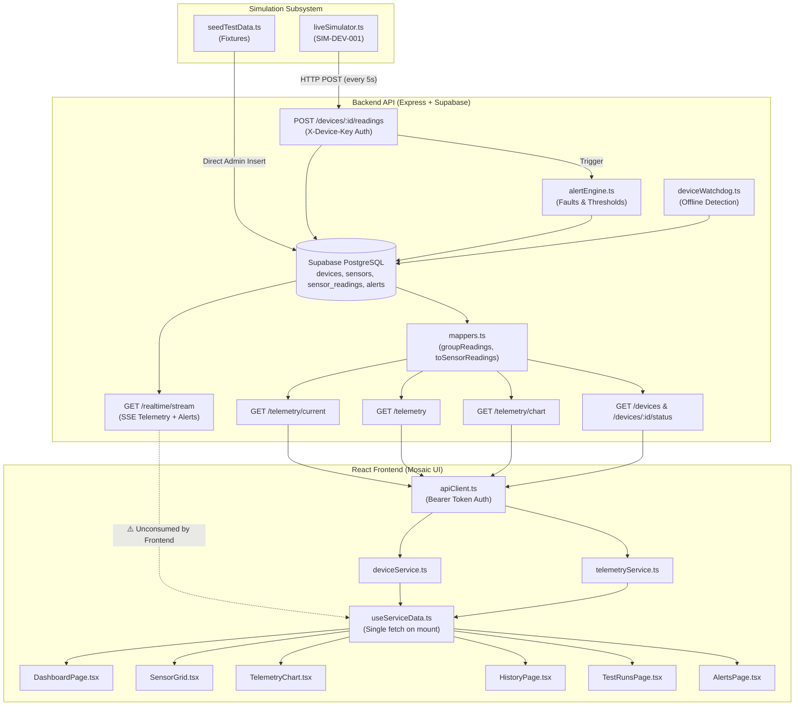

# Audit Report: Frontend and Simulation Integration

**Repository**: `iot-water-filtration-system`  
**Date**: October 1, 2026  
**Auditor**: Antigravity Autonomous Agent  
**Audited Branch**: `integration/frontend-api-connection`  

---

## 1. Executive Summary

This audit evaluated the technical, contractual, and architectural integration between the **Frontend Console** (`frontend/src/`) and the **Device Simulation** (`backend/scripts/liveSimulator.ts`, `backend/scripts/seedTestData.ts`, and backend ingestion routes).

### Overall Assessment: **Functional with Notable Integration Gaps**

- **Data Pipeline**: The core ingestion path (`liveSimulator.ts` -> `POST /devices/:id/readings` -> Supabase `sensor_readings` -> `GET /telemetry/*` -> `telemetryService` -> React UI) is functionally sound. Categories, positions, and units are mapped accurately.
- **Real-Time Integration Gap (Major)**: Although the backend provides Server-Sent Events (SSE) via `GET /realtime/stream` and `GET /telemetry/stream`, the frontend does not consume these streams. Dashboard updates during a live simulation require manual browser refreshes.
- **Failure State Masking (Moderate)**: When the simulator injects unavailable sensor states (`value: null, status: 'unavailable'`), backend mapping drops them from `GET /telemetry/current`, causing sensor cards to vanish from `SensorGrid.tsx` rather than displaying an explicit fault state.
- **Contract Workaround (Moderate)**: The backend `GET /devices/:id/status` endpoint omits the `is_simulated` field. The frontend works around this by making a secondary call to `GET /devices` and picking `devices[0]`, which introduces multi-device ambiguity.
- **Test Run Disconnect (Moderate)**: The live simulator emits telemetry without a `testRunId`, leaving test runs permanently reporting zero telemetry counts during live simulations.
- **AGENTS.md & Governance Compliance (Good)**: The frontend clearly labels simulated device telemetry, includes prominent potability disclaimers, and keeps laboratory validation records isolated from raw telemetry.

---

## 2. Architecture and Data Flow



---

## 3. Findings Matrix

| Finding ID | Severity | Component | Issue Summary | Code Reference |
|---|---|---|---|---|
| `AUDIT-01` | **High** | Frontend & Realtime | **Missing Live-Sync (SSE Integration Gap)**: Backend provides SSE streams, but frontend only executes a single fetch on mount via `useServiceData.ts`. Running `npm run simulate` does not update the dashboard without a manual page reload. | [`backend/src/routes/realtime.routes.ts#L17-L51`](file:///home/hikaru/Commisions/iot-water-filtration-system/backend/src/routes/realtime.routes.ts#L17-L51)<br/>[`frontend/src/hooks/useServiceData.ts#L33-L46`](file:///home/hikaru/Commisions/iot-water-filtration-system/frontend/src/hooks/useServiceData.ts#L33-L46)<br/>[`frontend/src/pages/DashboardPage.tsx#L28-L33`](file:///home/hikaru/Commisions/iot-water-filtration-system/frontend/src/pages/DashboardPage.tsx#L28-L33) |
| `AUDIT-02` | **High** | Backend Mappers & UI Presentation | **Unavailable Sensor Dropout vs Visible Failure State**: When `liveSimulator.ts` emits `value: null, status: 'unavailable'`, `toSensorReadings` completely drops the record. Rather than rendering an "Unavailable / Sensor Fault" card in `SensorGrid.tsx`, the card vanishes from the UI. | [`backend/scripts/liveSimulator.ts#L115-L121`](file:///home/hikaru/Commisions/iot-water-filtration-system/backend/scripts/liveSimulator.ts#L115-L121)<br/>[`backend/src/lib/mappers.ts#L233-L243`](file:///home/hikaru/Commisions/iot-water-filtration-system/backend/src/lib/mappers.ts#L233-L243)<br/>[`frontend/src/components/telemetry/SensorGrid.tsx#L7`](file:///home/hikaru/Commisions/iot-water-filtration-system/frontend/src/components/telemetry/SensorGrid.tsx#L7) |
| `AUDIT-03` | **Medium** | Frontend Formatters | **Uncaught TypeError Risk on Null Sensor Values**: `formatSensorValue(parameter, value)` directly executes `value.toFixed(...)` without null/undefined validation. | [`frontend/src/utils/formatters.ts#L16-L18`](file:///home/hikaru/Commisions/iot-water-filtration-system/frontend/src/utils/formatters.ts#L16-L18) |
| `AUDIT-04` | **Medium** | Simulator & Backend Hydration | **Simulated Telemetry Detached from Test Runs**: `liveSimulator.ts` does not attach a `testRunId`, so all simulated telemetry has `test_run_id = null`. Active test runs in the UI permanently show `telemetryCount: 0`. | [`backend/scripts/liveSimulator.ts#L128`](file:///home/hikaru/Commisions/iot-water-filtration-system/backend/scripts/liveSimulator.ts#L128)<br/>[`backend/src/lib/testRunHydrator.ts#L19-L37`](file:///home/hikaru/Commisions/iot-water-filtration-system/backend/src/lib/testRunHydrator.ts#L19-L37)<br/>[`frontend/src/pages/TestRunsPage.tsx#L31`](file:///home/hikaru/Commisions/iot-water-filtration-system/frontend/src/pages/TestRunsPage.tsx#L31) |
| `AUDIT-05` | **Medium** | Backend Mappers & Frontend Services | **Contract Incompleteness in `GET /devices/:id/status`**: Backend `toDeviceStatus()` and `DeviceStatus` type do not return `is_simulated`. Frontend `deviceService.ts` executes a secondary `GET /devices` call and takes `devices[0].is_simulated`. | [`backend/src/lib/mappers.ts#L182-L191`](file:///home/hikaru/Commisions/iot-water-filtration-system/backend/src/lib/mappers.ts#L182-L191)<br/>[`backend/src/types/domain.ts#L116-L123`](file:///home/hikaru/Commisions/iot-water-filtration-system/backend/src/types/domain.ts#L116-L123)<br/>[`frontend/src/services/deviceService.ts#L7-L12`](file:///home/hikaru/Commisions/iot-water-filtration-system/frontend/src/services/deviceService.ts#L7-L12) |
| `AUDIT-06` | **Low** | Frontend History Export | **Truncated CSV Export**: `HistoryPage.tsx` client CSV export only includes pH, Turbidity, and TDS, omitting Temperature and Flow Rate readings generated by the simulator. | [`frontend/src/pages/HistoryPage.tsx#L19`](file:///home/hikaru/Commisions/iot-water-filtration-system/frontend/src/pages/HistoryPage.tsx#L19) |
| `AUDIT-07` | **Low** | Architecture & Repo Structure | **Top-Level `simulator/` Directory Disconnect**: Top-level `simulator/` is an empty placeholder directory with only `.gitkeep`, while active simulation scripts live under `backend/scripts/liveSimulator.ts`. | [`simulator/.gitkeep`](file:///home/hikaru/Commisions/iot-water-filtration-system/simulator/.gitkeep)<br/>[`backend/scripts/liveSimulator.ts`](file:///home/hikaru/Commisions/iot-water-filtration-system/backend/scripts/liveSimulator.ts)<br/>[`README.md#L52`](file:///home/hikaru/Commisions/iot-water-filtration-system/README.md#L52) |
| `AUDIT-08` | **Low** | Data Provenance & Contracts | **Telemetry Records Lack Direct Provenance Tag**: `docs/API_CONTRACT.md` §4 specifies that telemetry payloads should identify their source (`"source": "device"` vs `"source": "simulator"`). Currently only `devices.is_simulated` holds this distinction; individual `TelemetryRecord` objects lack source tags. | [`docs/API_CONTRACT.md#L76-L100`](file:///home/hikaru/Commisions/iot-water-filtration-system/docs/API_CONTRACT.md#L76-L100)<br/>[`backend/src/lib/mappers.ts#L209-L231`](file:///home/hikaru/Commisions/iot-water-filtration-system/backend/src/lib/mappers.ts#L209-L231)<br/>[`frontend/src/types/index.ts#L26-L33`](file:///home/hikaru/Commisions/iot-water-filtration-system/frontend/src/types/index.ts#L26-L33) |

---

## 4. Deep-Dive Analysis of Key Findings

### AUDIT-01: Missing Real-Time Streaming Integration
- **Root Cause**: The backend team implemented Server-Sent Events (SSE) via `GET /realtime/stream` (and `/telemetry/stream`), multiplexing incoming readings and alert events. However, the frontend domain services in `integration/frontend-api-connection` strictly use static HTTP requests via `apiClient.ts` wrapped in `useServiceData.ts`.
- **Runtime Impact**: When a developer starts `npm run simulate`, new telemetry batches are successfully posted every 5 seconds, alerts are evaluated, and database rows are created. However, the frontend dashboard remains completely static. The operator must manually refresh the browser to see the simulator's progress.
- **Recommended Remediation**:
  1. Add an SSE client hook `useRealtimeStream()` in `frontend/src/hooks/useRealtimeStream.ts` that connects to `GET /api/v1/realtime/stream` using an authenticated EventSource or fetch stream.
  2. Allow `useServiceData` or `DashboardPage` to merge streamed telemetry updates into state without requiring full page refreshes.

### AUDIT-02: Unavailable Sensor Dropout in `SensorGrid`
- **Root Cause**: In `backend/src/lib/mappers.ts`, `toSensorReadings()` explicitly filters out rows where `row.value === null || row.value === undefined`:
  ```typescript
  export function toSensorReadings(rows: SensorReadingWithSensor[]): SensorReading[] {
    return rows
      .filter((row) => row.value !== null && row.value !== undefined)
      .map(...)
  }
  ```
- **Runtime Impact**: When `liveSimulator.ts` exercises the `value: null / status: "unavailable"` path (which occurs on ~3% of simulated cycles), the affected sensor row is filtered out of `GET /telemetry/current`. In `SensorGrid.tsx`, that sensor card simply disappears from the grid for that cycle, rather than displaying an "Unavailable" or "Fault" card.
- **Recommended Remediation**:
  Allow `toSensorReadings` to return `value: number | null` (or include a `status` field in `SensorReading`), and update `SensorGrid.tsx` to display an error/unavailable badge for sensors reporting null.

### AUDIT-03: `formatSensorValue` TypeError Vulnerability
- **Root Cause**: `formatSensorValue` in `frontend/src/utils/formatters.ts` assumes `value` is always a valid number:
  ```typescript
  export function formatSensorValue(parameter: SensorParameter, value: number) {
    return value.toFixed(sensorDecimals[parameter])
  }
  ```
- **Runtime Impact**: If any telemetry response contains `null` or `undefined` (or if `toSensorReadings` is updated to retain nulls), `value.toFixed()` will throw `TypeError: Cannot read properties of null (reading 'toFixed')`, causing a crash in `SensorGrid`.
- **Recommended Remediation**:
  ```typescript
  export function formatSensorValue(parameter: SensorParameter, value: number | null | undefined): string {
    return typeof value === 'number' && Number.isFinite(value)
      ? value.toFixed(sensorDecimals[parameter])
      : '—'
  }
  ```

### AUDIT-04: Simulated Telemetry Detached from Test Runs
- **Root Cause**: `liveSimulator.ts` builds reading batches without specifying `testRunId`:
  ```typescript
  const body = { measuredAt: new Date().toISOString(), readings: buildReadingBatch() }
  ```
  Consequently, `sensor_readings.test_run_id` is stored as `null`. In `backend/src/lib/testRunHydrator.ts`, test runs compute `telemetryCount` by querying `sensor_readings.test_run_id = row.id`.
- **Runtime Impact**: If a user creates a test run in `TestRunsPage.tsx` and starts the simulator, the test run's telemetry count remains `0`, and no simulator readings or alerts are linked to the test run inspector.
- **Recommended Remediation**:
  Add support for a `LIVE_SIM_TEST_RUN_ID` environment variable or command-line argument in `liveSimulator.ts`, or add an option to automatically bind to any currently active ("In Progress") test run.

### AUDIT-05: Missing `isSimulated` in `GET /devices/:id/status`
- **Root Cause**: Backend `toDeviceStatus` maps:
  ```typescript
  export function toDeviceStatus(row: DeviceRow & { latestReadingAt?: string | null }): DeviceStatus {
    return {
      deviceId: row.id,
      controller: row.controller_name ?? row.name ?? 'Unknown Controller',
      connection: row.connection_state ?? 'Pending Hardware Integration',
      wifiConnection: row.wifi_state ?? 'Not Configured',
      failSafeControl: row.fail_safe_state ?? 'Pending Hardware Integration',
      lastUpdatedAt: row.last_seen_at ?? row.latestReadingAt ?? undefined,
    }
  }
  ```
  `is_simulated` exists on `devices` table, but is omitted from `toDeviceStatus` and `DeviceStatus` domain type.
- **Runtime Impact**: Frontend `deviceService.ts` is forced to make two round trips: `GET /devices` then `GET /devices/:id/status`, and arbitrarily takes `devices[0].is_simulated`. If a multi-device setup exists, the simulator status may misattribute simulation flags.
- **Recommended Remediation**:
  Add `isSimulated: row.is_simulated === true` directly into `toDeviceStatus()` and update `backend/src/types/domain.ts`.

---

## 5. AGENTS.md & Governance Compliance Check

| Governance Mandate | Compliance Status | Audit Evidence |
|---|---|---|
| **Simulated data must be explicitly identified** | **Compliant** | In `DashboardPage.tsx#L115`, device status renders `<StatusBadge tone="Pending">{device?.isSimulated ? 'Simulated device' : 'Connection not verified'}</StatusBadge>`. `seed.sql` sets `name: 'Simulated Filtration Unit'`. |
| **Never disguise simulated data as laboratory results** | **Compliant** | `DashboardPage.tsx#L111` displays: *"An API record is not a verified laboratory report or evidence of potability."* Laboratory validation records are stored in a dedicated table `laboratory_validation_records` with distinct UI flows. |
| **Do not claim potability solely from sensor readings** | **Compliant** | `DashboardPage.tsx#L126` prominently displays: *"Sensor readings describe monitored physical parameters. Sensor telemetry alone does not establish microbiological potability, certification, or regulatory compliance."* |
| **No secrets in frontend code** | **Compliant** | Frontend only accesses `VITE_API_BASE_URL`. `X-Device-Key` and Supabase service-role keys are strictly kept on the backend. |
| **Local control safety on ESP32** | **Compliant** | Frontend contains no hardware override controls; device status card reflects fail-safe control status (`Local Control Active` / `Pending Hardware Integration`). |

---

## 6. Actionable Recommendations for Team Members

### For Nash (Project Lead & Frontend):
1. **Implement Realtime Stream Listener**: Create an SSE hook (`useRealtimeStream`) to consume `GET /api/v1/realtime/stream` and push telemetry updates into the dashboard state automatically.
2. **Defensive Formatting**: Update `formatSensorValue` in `frontend/src/utils/formatters.ts` to safely handle null/undefined without throwing `TypeError`.
3. **Handle Unavailable Sensors**: Update `SensorGrid.tsx` to display an explicit "Fault / Unavailable" card when a sensor reports no value.
4. **Complete CSV Export**: Include `temperature` and `flowRate` in `HistoryPage.tsx` client export.

### For Alejandro (Backend & Database):
1. **Extend `DeviceStatus` Contract**: Include `isSimulated: row.is_simulated === true` in `toDeviceStatus()` and `GET /devices/:id/status` to eliminate frontend two-step querying.
2. **Preserve Unavailable Readings in `/current`**: Instead of dropping `value === null` rows in `toSensorReadings()`, preserve them with `value: null` and an explicit `status: 'unavailable'` field so the frontend can display sensor faults.
3. **Enhance `liveSimulator.ts`**: Allow `liveSimulator.ts` to accept an optional `TEST_RUN_ID` or automatically associate with the current active test run.

### For Edgar (Firmware & Hardware Integration):
1. **Ingestion Parity**: Verify that the physical ESP32 payload structure matches the payload structure validated by `POST /devices/:id/readings` in `liveSimulator.ts`.
2. **Offline Watchdog**: Confirm that device watchdog timeouts (`DEVICE_WATCHDOG_INTERVAL_MS = 10s`) align with actual ESP32 Wi-Fi reconnect and transmission cycles.
