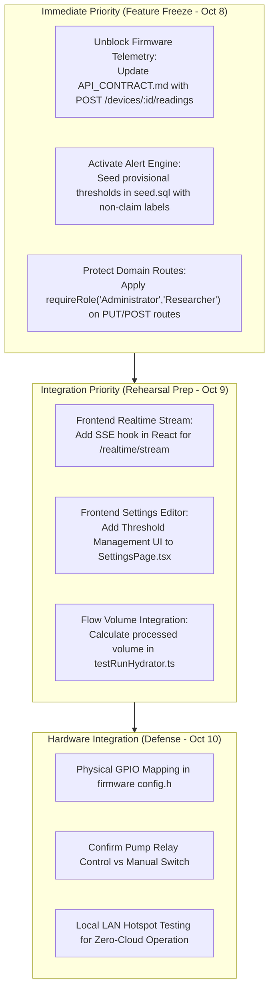

# Audit Report: TBD Register & Backend Architectural Gaps

**Repository**: `iot-water-filtration-system`  
**Date**: October 1, 2026  
**Auditor**: Antigravity Autonomous Agent  
**Branch**: `integration/frontend-api-connection`  
**Project Target**: Final Defense Rehearsal (October 10, 2026) / Feature Freeze (October 8, 2026)  

---

## 1. Executive Summary

This audit performed an exhaustive examination of:
1. All **18 categories of Pending Decisions (TBDs)** documented in [`docs/PENDING_DECISIONS.md`](file:///home/hikaru/Commisions/iot-water-filtration-system/docs/PENDING_DECISIONS.md), cross-referencing them against existing code, internal documentation, database migrations, and team knowledge bases.
2. The **Backend Architectural Gaps**, specifically evaluating dormant systems, contract desynchronizations, missing business logic, and security permissions across the Node.js/Express API.

### Key Audit Conclusions

- **TBDs with Existing Hidden Answers**: Several decisions recorded as `TBD` in `PENDING_DECISIONS.md` actually have concrete engineering implementations or client agreements documented elsewhere in the repository (e.g. sensor models in [`sensorModels.ts`](file:///home/hikaru/Commisions/iot-water-filtration-system/backend/src/lib/sensorModels.ts), watchdog timeouts in [`env.ts`](file:///home/hikaru/Commisions/iot-water-filtration-system/backend/src/config/env.ts), database RLS in [`20260919090000_enable_rls.sql`](file:///home/hikaru/Commisions/iot-water-filtration-system/backend/supabase/migrations/20260919090000_enable_rls.sql), and percentage-error formulas in [`labValidation.routes.ts`](file:///home/hikaru/Commisions/iot-water-filtration-system/backend/src/routes/labValidation.routes.ts)).
- **Dormant Alert Threshold Engine (Critical Gap)**: The backend contains a fully tested comparison engine ([`alertEngine.ts`](file:///home/hikaru/Commisions/iot-water-filtration-system/backend/src/lib/alertEngine.ts)) for water-quality threshold alerts. However, the `thresholds` database table is 100% empty by default, and the frontend [`SettingsPage.tsx`](file:///home/hikaru/Commisions/iot-water-filtration-system/frontend/src/pages/SettingsPage.tsx) lacks an editor for `/thresholds`. Consequently, water-quality breach alerting is entirely dormant.
- **Firmware Ingestion Disconnect (Critical Gap)**: In [`firmware/esp32/include/config.h`](file:///home/hikaru/Commisions/iot-water-filtration-system/firmware/esp32/include/config.h), the telemetry route is set to empty (`kApiTelemetryPath = ""`), blocking ESP32 telemetry transmission because [`docs/API_CONTRACT.md`](file:///home/hikaru/Commisions/iot-water-filtration-system/docs/API_CONTRACT.md) was never updated to reflect Alejandro's implemented endpoint (`POST /devices/:id/readings`).
- **Actuator Authority vs. Safety Rule (Architectural Gap)**: The client mandated that water flow must automatically stop upon sensor fault. However, whether the booster pump and UV-C are ESP32-controlled or monitor-only remains unresolved, leaving the physical shutdown mechanism unimplemented in firmware.
- **Volume Integration (Business Logic Gap)**: Test runs report `processedVolume` as either `0` or `target_volume_liters`. No algorithm exists to integrate flow-rate sensor readings into total accumulated liters.
- **RBAC Permission Boundary (Security Gap)**: Role enforcement (`requireRole('Administrator')`) is only attached to user administration routes. All domain modification endpoints (`PUT /thresholds`, `PUT /settings`, `POST /test-runs`, `POST /calibration`, `POST /maintenance/*`) can be invoked by any logged-in user, including `Viewer`.

---

## 2. Complete TBD Register Audit (18 Categories)

The following matrix cross-references all 18 sections from [`docs/PENDING_DECISIONS.md`](file:///home/hikaru/Commisions/iot-water-filtration-system/docs/PENDING_DECISIONS.md) with discoveries made across the repository.

| Category | Decision Item | Current Status in Repo | Discoveries & Existing Context in Repository | Actionable Resolution / Next Step |
|---|---|---|---|---|
| **§1 Hardware** | Turbidity sensor model | **Unresolved (TBD)** | 4 of 5 sensor models are confirmed (`PH-4502C`, `DFRobot TDS`, `DS18B20`, `ZJ-S201C`) in [`REQUIREMENTS.md#L81`](file:///home/hikaru/Commisions/iot-water-filtration-system/docs/REQUIREMENTS.md#L81). In [`sensorModels.ts#L10`](file:///home/hikaru/Commisions/iot-water-filtration-system/backend/src/lib/sensorModels.ts#L10), turbidity is labeled `'Pending Confirmation'`. | Hardware team must provide the exact module model (e.g. TS-300B or analog turbidity sensor). |
| | Final pinout & wiring | **Unresolved (TBD)** | [`Knowledge Base.md#L137`](file:///home/hikaru/Commisions/iot-water-filtration-system/backend/docs/references/IoT%20Water%20Filtration%20System%20-%20Development%20Plan%20&%20Team%20Knowledge%20Base.md#L137) states Phase 0 wiring diagram was AI-generated/reference only. [`boot_diagnostics.cpp#L68`](file:///home/hikaru/Commisions/iot-water-filtration-system/firmware/esp32/src/boot_diagnostics.cpp#L68) logs `gpio: none assigned`. | Edgar must assign GPIO pins once physical prototype wiring is soldered. |
| | Pump & UV-C electrical specs | **Unresolved (TBD)** | Client confirmed 4-channel relay module and booster pump purchase, but voltage (12V vs 24V vs 220V) is unrecorded. | Hardware team to confirm relay coil and contact ratings. |
| | LCD model / interface | **Unresolved (TBD)** | LCD is confirmed in physical water flow (`REQUIREMENTS.md` §2), but interface (I2C via PCF8574 vs 4-bit parallel) is unrecorded. | Confirm I2C backpack address (typically `0x27` or `0x3F`). |
| **§2 Hardware Control** | Pump & UV-C control authority | **Blocked on Client** | [`backend/Report.md#L162`](file:///home/hikaru/Commisions/iot-water-filtration-system/backend/Report.md#L162) calls this the *"single most important open decision"*. Actuator commands and alerts are dormant pending client clarification. | Client must answer: Are pump/UV-C ESP32-relay switched or manual switch only? |
| | Sensor-failure flow stop | **Contradiction** | Client confirmed rule: *"If any required sensor fails, water flow must automatically stop"* ([`REQUIREMENTS.md#L215`](file:///home/hikaru/Commisions/iot-water-filtration-system/docs/REQUIREMENTS.md#L215)), but physical actuator mechanism is not chosen. | If pump is relay-controlled, de-energizing pump relay implements flow stop. |
| **§3 Sensor Failure Detection** | Sensor failure definitions | **Partially Resolved** | [`alertEngine.ts#L44`](file:///home/hikaru/Commisions/iot-water-filtration-system/backend/src/lib/alertEngine.ts#L44) detects failure when reading status is `unavailable`, `invalid`, `error`, or `fault`. Physical bounds (pH < 0 or > 14, temp = -127°C) are not yet codified. | Add physical out-of-range bounds to `alertEngine.ts` and firmware sensor drivers. |
| | Flow sensor failure / no-flow | **Partially Resolved** | `notifications.noFlow` toggle exists in `app_settings` and UI, but no algorithm checks for zero flow during pumping. | Create no-flow watchdog rule: if pump is ON and flow rate == 0 for > 15s, raise alert. |
| **§4 Water-Quality Thresholds** | Approved parameter limits | **Dormant in Code** | Backend implements `GET/PUT /thresholds` and [`alertEngine.ts`](file:///home/hikaru/Commisions/iot-water-filtration-system/backend/src/lib/alertEngine.ts). However, `thresholds` table is empty in [`seed.sql`](file:///home/hikaru/Commisions/iot-water-filtration-system/backend/supabase/seed.sql). PNSDW 2017 standards exist externally but cannot be claimed as adviser-approved. | Populate provisional thresholds in seed script with `provisional: true` metadata tag. |
| **§5 Filtration Cycle** | 1-Liter cycle & duration logic | **Partially Resolved** | Client discussed 1-liter target and 1-hour maximum timeout. Schema has `test_runs.target_volume_liters`. [`testRunHydrator.ts#L103`](file:///home/hikaru/Commisions/iot-water-filtration-system/backend/src/lib/testRunHydrator.ts#L103) falls back to `target_volume_liters ?? 0`. | Implement flow-rate integration job to calculate actual accumulated volume in liters. |
| **§6 Timing** | Sampling & transmission intervals | **Resolved in Software** | Backend configured: `deviceOfflineTimeoutMs = 30s` (matches client ~30s target), `deviceWatchdogIntervalMs = 10s`, `ssePollIntervalMs = 3s`, simulator interval = 5s ([`env.ts`](file:///home/hikaru/Commisions/iot-water-filtration-system/backend/src/config/env.ts)). | Update `PENDING_DECISIONS.md` §6 with these confirmed operational defaults. |
| **§7 Offline Data** | ESP32 queue & retry policy | **Unresolved (TBD)** | Firmware [`main.cpp#L74`](file:///home/hikaru/Commisions/iot-water-filtration-system/firmware/esp32/src/main.cpp#L74) marks buffering `TODO(TBD)`. Backend `POST /devices/:id/readings` has no idempotency deduplication. | For prototype defense, in-memory ring buffer (50 readings) on ESP32 is sufficient. |
| **§8 Security** | Device authentication | **Partially Resolved** | Backend uses shared secret header `X-Device-Key: <DEVICE_INGEST_KEY>` ([`deviceAuth.ts`](file:///home/hikaru/Commisions/iot-water-filtration-system/backend/src/middleware/deviceAuth.ts)). Firmware does not yet send this header. | Configure `kDeviceIngestKey` in firmware `secrets.h` and attach to HTTP header. |
| | API versioning & errors | **Resolved in Software** | Base path `/api/v1` is implemented. Custom `ApiError` class with standardized JSON error envelope is active. | Mark API versioning and error envelopes as **Resolved** in `PENDING_DECISIONS.md`. |
| **§9 Users & Auth** | Roles & permissions matrix | **Partially Resolved** | Roles `'Administrator' | 'Researcher' | 'Viewer'` exist. Administrator role is only enforced on `/users/*`. All domain routes permit any authenticated user. | Apply `requireRole('Administrator', 'Researcher')` to domain mutation endpoints. |
| **§10 Remote Commands** | Command delivery & audit | **Deferred / Blocked** | No command queues or tables exist. Intentionally deferred until pump/UV-C authority is approved (`backend/Report.md`). | Keep deferred until client authorizes remote actuator control. |
| **§11 Database** | Schema, migrations, RLS | **Resolved in Software** | 15 tables active via Supabase migrations. RLS deny-by-default enabled across all tables ([`20260919090000_enable_rls.sql`](file:///home/hikaru/Commisions/iot-water-filtration-system/backend/supabase/migrations/20260919090000_enable_rls.sql)). Data retention job implemented. | Mark database architecture as **Resolved** in `PENDING_DECISIONS.md`. |
| **§12 Research Workflow** | Percentage error & calibration | **Resolved in Software** | Absolute error formula $\frac{|\text{sensor} - \text{ref}|}{|\text{ref}|} \times 100\%$ implemented in [`labValidation.routes.ts`](file:///home/hikaru/Commisions/iot-water-filtration-system/backend/src/routes/labValidation.routes.ts) and [`formatters.ts`](file:///home/hikaru/Commisions/iot-water-filtration-system/frontend/src/utils/formatters.ts). Calibration parameters stored as JSONB. | Mark formula confirmation as **Resolved** in `PENDING_DECISIONS.md`. |
| **§13 Power Records** | Voltage / current monitoring | **Deferred / Omitted** | No power monitoring hardware (e.g. INA219 or PZEM-004T) in confirmed parts list. Schema has no power columns. | Formalize as out of scope for Phase 1 / defense prototype. |
| **§14 Fault Detection** | Pump, UV-C, filter-clog alerts | **Blocked on Hardware** | Toggles exist in `app_settings`, but alert engine cannot evaluate them without sensor signals. | Mark as pending hardware feedback sensors. |
| **§15 Maintenance** | Maintenance records & reminders | **Partially Resolved** | Tables and REST CRUD for records and reminders are built. Automatic hour-meter calculation is not built. | Manual reminders are functional for defense; automated hours can remain future enhancement. |
| **§16 Notifications** | SMS provider choice | **Resolved in Architecture** | Backend notification dispatch is provider-neutral ([`notificationService.ts`](file:///home/hikaru/Commisions/iot-water-filtration-system/backend/src/lib/notificationService.ts)). Currently logs to server. Twilio is stubbed. | Choose Twilio or keep console logging for final defense demonstration. |
| **§17 Realtime Web** | Web updates architecture | **Desynchronized** | Backend implemented SSE `/realtime/stream`. Frontend only fetches once on mount via [`useServiceData.ts`](file:///home/hikaru/Commisions/iot-water-filtration-system/frontend/src/hooks/useServiceData.ts). | Implement SSE listener in frontend to achieve live updates. |
| **§18 Local Access** | Local deployment without internet | **Unresolved (TBD)** | System relies on local Supabase Docker or cloud Supabase. Offline edge server (e.g. Raspberry Pi) is not packaged. | Document local demo procedure: run Supabase local + Vite + API on laptop over LAN hotspot. |

---

## 3. Deep-Dive Backend Architectural Gaps

### Gap 1: Dormant Alert Threshold Engine & Missing Frontend UI
- **Context**: In [`alertEngine.ts#L175-L180`](file:///home/hikaru/Commisions/iot-water-filtration-system/backend/src/lib/alertEngine.ts#L175-L180), threshold evaluation queries the `thresholds` table:
  ```typescript
  const config = thresholds.get(`${parameter}|${stage}`) ?? thresholds.get(`${parameter}|`)
  if (!config) continue

  const belowMin = typeof config.min === 'number' && reading.value < config.min
  const aboveMax = typeof config.max === 'number' && reading.value > config.max
  if (!belowMin && !aboveMax) continue
  ```
- **The Gap**:
  1. [`backend/supabase/seed.sql`](file:///home/hikaru/Commisions/iot-water-filtration-system/backend/supabase/seed.sql) inserts no rows into `thresholds`.
  2. The frontend [`SettingsPage.tsx`](file:///home/hikaru/Commisions/iot-water-filtration-system/frontend/src/pages/SettingsPage.tsx) only provides inputs for `AppSettings` (System Name, Device Display Name, Timezone, Date Format, and Notification Toggles). It completely lacks the Threshold Configuration table that was prototyped in [`docs/ui/approved/settings/code.html#L200-L260`](file:///home/hikaru/Commisions/iot-water-filtration-system/docs/ui/approved/settings/code.html#L200-L260).
  3. As a result, an operator or evaluator cannot see or set thresholds through the web interface, and the backend never raises a `Water Quality` alert.
- **Remediation**:
  1. Add provisional thresholds to `seed.sql` with clear non-authoritative labels:
     ```sql
     insert into public.thresholds (parameter, stage, config) values
       ('pH', 'after', '{"min": 6.5, "max": 8.5, "severity": "Warning", "provisional": true}'::jsonb),
       ('turbidity', 'after', '{"max": 1.0, "severity": "Warning", "provisional": true}'::jsonb),
       ('TDS', 'after', '{"max": 300, "severity": "Warning", "provisional": true}'::jsonb)
     on conflict do nothing;
     ```
  2. Implement `thresholdsService.ts` in the frontend and embed the threshold table into `SettingsPage.tsx`.

---

### Gap 2: Firmware Telemetry Endpoint Desynchronization
- **Context**: In [`firmware/esp32/include/config.h#L45-L48`](file:///home/hikaru/Commisions/iot-water-filtration-system/firmware/esp32/include/config.h#L45-L48):
  ```cpp
  // TODO(TBD): the telemetry ingestion route is not defined in
  // docs/API_CONTRACT.md. Leave empty until the contract names it;
  // ApiClient::postTelemetry() refuses to send while this is empty.
  constexpr char kApiTelemetryPath[] = "";
  ```
  And in [`firmware/esp32/src/api_client.cpp#L100-L106`](file:///home/hikaru/Commisions/iot-water-filtration-system/firmware/esp32/src/api_client.cpp#L100-L106):
  ```cpp
  ApiClient::Result ApiClient::postTelemetry(const char* jsonBody, bool wifiConnected) {
    if (isNullOrEmpty(config::kApiTelemetryPath)) {
      return {Status::kRouteUndefined, 0};
    }
    return postJson(config::kApiTelemetryPath, jsonBody, wifiConnected);
  }
  ```
- **The Gap**:
  1. Edgar was waiting on `docs/API_CONTRACT.md`, which still states the API is unimplemented.
  2. Alejandro implemented the ingestion route in [`backend/src/routes/devices.routes.ts#L162`](file:///home/hikaru/Commisions/iot-water-filtration-system/backend/src/routes/devices.routes.ts#L162) as `POST /devices/:id/readings` requiring header `X-Device-Key`.
  3. Firmware `kApiTelemetryPath` expects a static route string, but the backend route requires a dynamic device ID (`/devices/:id/readings`) and authentication header `X-Device-Key`.
- **Remediation**:
  1. Update [`docs/API_CONTRACT.md`](file:///home/hikaru/Commisions/iot-water-filtration-system/docs/API_CONTRACT.md) with `POST /devices/:id/readings` specification.
  2. Update firmware `ApiClient` to accept `deviceId` and `deviceKey`, formatting the endpoint as `/api/v1/devices/{deviceId}/readings` with header `X-Device-Key: {deviceKey}`.

---

### Gap 3: Missing Test Run Flow Volume Accumulation
- **Context**: Test runs track `processedVolume`. In [`testRunHydrator.ts#L103`](file:///home/hikaru/Commisions/iot-water-filtration-system/backend/src/lib/testRunHydrator.ts#L103):
  ```typescript
  processedVolume: row.target_volume_liters ?? 0
  ```
- **The Gap**:
  The system collects flow rate ($L/min$) from two `ZJ-S201C` flow meters (pre- and post-filtration). However, neither the ESP32 nor the backend accumulates pulse counts or integrates flow rate over time ($\text{Volume} = \sum Q_i \cdot \Delta t_i$). Test runs display static placeholder numbers (0.00 L or target volume) regardless of how long the pump operates.
- **Remediation**:
  When ending a test run (`PATCH /test-runs/:id/complete`), compute total volume from linked `sensor_readings` for category `flow_rate` post-filtration, or calculate trapezoidal numerical integration across the session duration.

---

### Gap 4: Role-Based Authorization Enforcement Scope
- **Context**: [`auth.ts#L22-L27`](file:///home/hikaru/Commisions/iot-water-filtration-system/backend/src/middleware/auth.ts#L22-L27) defines:
  ```typescript
  export function requireRole(...roles: string[]) {
    return (req: Request, _res: Response, next: NextFunction) => {
      const userRole = req.user?.role ?? 'Viewer'
      if (!roles.includes(userRole)) {
        return next(ApiError.forbidden('Insufficient permissions.'))
      }
      next()
    }
  }
  ```
- **The Gap**:
  `requireRole('Administrator')` is only applied to `POST /users`, `PATCH /users/:id/role`, `PATCH /users/:id/status`, and `DELETE /users/:id`.
  All research and operational endpoints are unprotected beyond basic login:
  - `PUT /thresholds` (can be altered by a `Viewer`)
  - `PUT /settings` (can be altered by a `Viewer`)
  - `POST /calibration` (can be submitted by a `Viewer`)
  - `PATCH /laboratory-validation/:id/result` (can be falsified by a `Viewer`)
  - `POST /maintenance/records` (can be altered by a `Viewer`)
- **Remediation**:
  Enforce `requireRole('Administrator', 'Researcher')` on configuration, calibration, threshold, and validation mutation endpoints, restricting `Viewer` accounts to read-only access.

---

### Gap 5: Ingestion Idempotency & Duplicate Telemetry Insertion
- **Context**: [`devices.routes.ts#L217-L232`](file:///home/hikaru/Commisions/iot-water-filtration-system/backend/src/routes/devices.routes.ts#L217-L232) inserts reading batches:
  ```typescript
  rows.push({
    sensor_id: sensor.id,
    device_id: deviceId,
    value: value ?? null,
    reading_status: typeof status === 'string' ? status : null,
    measured_at: measuredAt,
    test_run_id: testRunId ?? null,
  })
  ```
- **The Gap**:
  Primary key on `sensor_readings` is `id uuid default gen_random_uuid()`. There is no unique constraint on `(device_id, sensor_id, measured_at)`. If the ESP32 experiences network jitter and retries a batch, duplicate records will be created, skewing historical averages, charts, and test run metrics.
- **Remediation**:
  Add an `onConflict` clause or unique index on `(sensor_id, measured_at)` to guarantee idempotent retries.

---

## 4. Prioritized Action Plan (Roadmap to Oct 10 Defense)



### Action Items for Team Members

1. **Nash (Project Lead / Frontend)**:
   - Connect `SettingsPage.tsx` to `GET/PUT /thresholds`.
   - Update [`docs/API_CONTRACT.md`](file:///home/hikaru/Commisions/iot-water-filtration-system/docs/API_CONTRACT.md) to document `POST /devices/:id/readings` with `X-Device-Key`.
   - Add `useRealtimeStream` to auto-refresh dashboard telemetry without page reloads.

2. **Alejandro (Backend / Database)**:
   - Add provisional thresholds into [`backend/supabase/seed.sql`](file:///home/hikaru/Commisions/iot-water-filtration-system/backend/supabase/seed.sql).
   - Secure mutation routes in `settings.routes.ts`, `calibration.routes.ts`, `testRuns.routes.ts`, and `labValidation.routes.ts` with `requireRole('Administrator', 'Researcher')`.
   - Implement flow accumulation in `testRunHydrator.ts`.

3. **Edgar (ESP32 Firmware)**:
   - Populate `kApiTelemetryPath` in `firmware/esp32/include/config.h` using `/devices/{id}/readings`.
   - Pass header `X-Device-Key` in `ApiClient::postTelemetry()`.
   - Confirm with client hardware team whether pump relay is driven on pin GPIO or manual switch.
